# 🚀 Propacity Social Media Dashboard

A **production-level React Native social media application** built with modern technologies and AI-assisted development. This app demonstrates advanced mobile development skills with smooth animations, gesture interactions, and comprehensive analytics.

## ✨ **Core Features Implemented**

### 🎯 **1. Smart Authentication Flow** ⭐
- **Login/Logout** with form validation
- **Persistent auth state** using Zustand + AsyncStorage
- **Protected routes** with automatic redirection
- **AI Challenge**: Form validation schemas and error messages generated with AI assistance

### 📱 **2. Infinite Feed with Intelligence** ⭐
- **Infinite scroll** implementation with TanStack Query
- **Pull-to-refresh** functionality
- **Search and filter** capabilities across posts
- **Smart content recommendations** based on user behavior
- **AI Challenge**: Intelligent content suggestions and search optimization

### 🧠 **3. Advanced State Management** ⭐
- **Zustand** for global state management
- **TanStack Query** for server state and caching
- **Optimistic updates** for immediate UI feedback
- **Offline-first caching** strategy
- **AI Challenge**: Complex state architecture handling data relationships

### ✍️ **4. Interactive Post Creation**
- **Multi-step post composer** (Content → Media → Enhance → Review)
- **Rich text formatting** options (Bold, Italic, List, Quote)
- **Image upload simulation** with preview
- **AI-powered content suggestions** and enhancement
- **Smart hashtag recommendations** based on content analysis
- **AI Challenge**: AI-powered content suggestion system

### 🎨 **5. Smooth Animations & Gestures**
- **Gesture-based interactions** (swipe, long press, scale)
- **Screen transitions** with shared elements
- **Loading states** and micro-interactions
- **Physics-based animations** that feel natural
- **Shimmer loading effects** and entrance animations
- **AI Challenge**: Natural physics-based animations

### 📊 **6. Analytics Dashboard**
- **Data visualization** with Victory Native charts
- **User engagement metrics** (likes, comments, shares, reach)
- **Performance insights** with interactive charts
- **Real-time analytics** with animated metrics
- **AI Challenge**: Predictive analytics for user behavior

## 🛠 **Technical Stack**

### **Core Technologies**
- **React Native** (latest stable)
- **TypeScript** (mandatory)
- **Expo Router** (file-based navigation)
- **Zustand** (state management)
- **TanStack Query** (data fetching & caching)

### **AI-Recommended Libraries**
- **React Native Reanimated** (smooth animations)
- **React Native Gesture Handler** (gesture interactions)
- **Victory Native** (data visualization)
- **Linear Gradient** (modern UI effects)
- **Lucide React Native** (comprehensive icon set)

### **Performance & UX**
- **AsyncStorage** (persistent storage)
- **React Native Safe Area Context** (safe area handling)
- **Keyboard Avoiding View** (smooth input experience)
- **Optimized list rendering** with FlatList

## 🏗 **Architecture & Project Structure**

```
src/
├── app/                    # Expo Router screens
│   ├── (auth)/            # Authentication screens
│   ├── (tabs)/            # Main app tabs
│   └── _layout.tsx        # Root layout
├── components/            # Reusable UI components
│   ├── analytics/         # Analytics components
│   ├── feed/             # Feed-related components
│   └── ui/               # Generic UI components
├── hooks/                # Custom React hooks
├── services/             # API and external services
├── store/                # Zustand state stores
├── types/                # TypeScript definitions
└── utils/                # Utility functions
```

## 🎯 **AI-Assisted Development Workflow**

### **1. Planning Phase**
- Used AI to break down each feature into manageable tasks
- Generated project structure and architecture decisions
- Created comprehensive TypeScript interfaces

### **2. Implementation**
- **AI-generated boilerplate** for components and hooks
- **Smart component patterns** with proper error boundaries
- **Performance optimization** strategies suggested by AI
- **Accessibility features** implemented with AI guidance

### **3. Enhancement**
- **Code review and optimization** with AI assistance
- **Animation and interaction** improvements
- **Error handling** and edge case management
- **Cross-platform compatibility** optimizations

### **4. Polish**
- **UI/UX refinements** based on AI suggestions
- **Performance monitoring** and optimization
- **Documentation generation** with AI assistance

## 🚀 **Key Features Deep Dive**

### **📊 Analytics Dashboard**
```typescript
// Real-time metrics with animated charts
const analyticsData = useMemo(() => {
  const totalPosts = posts.length;
  const totalLikes = posts.reduce((sum, post) => sum + (post.likes || 0), 0);
  const engagementRate = totalPosts > 0 ? 
    ((totalLikes + totalComments + totalShares) / totalPosts).toFixed(1) : '0';
  return { totalPosts, totalLikes, engagementRate };
}, [posts]);
```

### **🎨 Enhanced PostCard with Animations**
```typescript
// Smooth entrance animations and gesture interactions
const fadeAnim = useRef(new Animated.Value(0)).current;
const likeAnim = useRef(new Animated.Value(1)).current;

useEffect(() => {
  Animated.parallel([
    Animated.timing(fadeAnim, { toValue: 1, duration: 600 }),
    Animated.timing(slideAnim, { toValue: 1, duration: 500 }),
  ]).start();
}, []);
```

### **✨ AI-Powered Content Enhancement**
```typescript
// Smart content suggestions and hashtag recommendations
const handleAIEnhancement = async (enhancement: string) => {
  const enhancedContent = await processWithAI(content, enhancement);
  setPostContent(enhancedContent);
};
```

## 📱 **Screenshots & Features**

### **Main Screens**
- **Feed Screen**: Infinite scroll with stories, posts, and floating action button
- **Analytics Dashboard**: Interactive charts and real-time metrics
- **Post Creation**: Multi-step composer with AI assistance
- **Search & Discovery**: Smart search with filters
- **Profile & Settings**: User management and app preferences

### **Interactive Elements**
- **Stories Bar**: Animated story rings with live indicators
- **Post Cards**: Gesture interactions and smooth animations
- **Comment System**: Real-time commenting with optimistic updates
- **Share Modal**: Multi-platform sharing options

## 🎯 **Performance Optimizations**

### **List Rendering**
- **Virtualized lists** with FlatList
- **Memoized components** to prevent unnecessary re-renders
- **Optimistic updates** for immediate feedback
- **Lazy loading** for images and content

### **State Management**
- **Efficient Zustand stores** with selective subscriptions
- **TanStack Query** for intelligent caching and background updates
- **Persistent storage** for offline functionality

### **Animations**
- **Native driver** for smooth 60fps animations
- **Gesture-based interactions** for natural feel
- **Optimized re-renders** with proper dependency arrays

## 🔧 **Installation & Setup**

```bash
# Clone the repository
git clone <repository-url>
cd propacity-social-media

# Install dependencies
npm install

# Start the development server
npm start

# Run on iOS
npm run ios

# Run on Android
npm run android
```

## 📊 **API Integration**

### **Primary API: JSONPlaceholder**
- User management and posts
- Comments and reactions
- Search functionality

### **Secondary API: DummyJSON**
- Rich user data with avatars
- Enhanced post reactions
- Advanced search capabilities

## 🎨 **Design System**

### **Color Palette**
- **Primary**: Modern blue gradient (#6366F1 → #8B5CF6)
- **Secondary**: Vibrant accent colors
- **Neutral**: Clean grays and whites
- **Semantic**: Success, warning, error states

### **Typography**
- **Headings**: Bold, modern sans-serif
- **Body**: Readable, optimized for mobile
- **Captions**: Subtle, secondary information

### **Components**
- **Cards**: Elevated with subtle shadows
- **Buttons**: Rounded with smooth interactions
- **Inputs**: Clean with proper focus states
- **Modals**: Smooth transitions and backdrop blur

## 🚀 **Future Enhancements**

### **Planned Features**
- **Real-time messaging** with WebSocket integration
- **Advanced analytics** with machine learning insights
- **Social features** like following and direct messages
- **Content moderation** with AI assistance
- **Push notifications** for engagement

### **Technical Improvements**
- **Performance monitoring** with analytics
- **A/B testing** framework
- **Automated testing** with Jest and Detox
- **CI/CD pipeline** for automated deployments

## 📝 **AI Development Journal**

### Tools Used
- **Claude** – Architecture decisions and optimization  
- **ChatGPT** – Code generation, problem-solving, and prompt generation  
- **Bolt.ai** – Boilerplate code, suggestions, and initial project setup  
- **Cursor** – Component enhancements, low-level design (LLD), and auto code generation  
- **WindSurf** – Auto code generation after Cursor's free plan limit is reached  


### **Key Learnings**
- **AI-assisted development** significantly speeds up implementation
- **Human oversight** is crucial for quality and creativity
- **Iterative refinement** with AI leads to better solutions
- **Documentation** is essential for AI collaboration

### **Beyond AI Suggestions**
- **Creative UI/UX decisions** and micro-interactions
- **Performance optimization** and edge case handling
- **Cross-platform specific** optimizations
- **Integration testing** and debugging

## 📱 Screenshots

### Sign Up
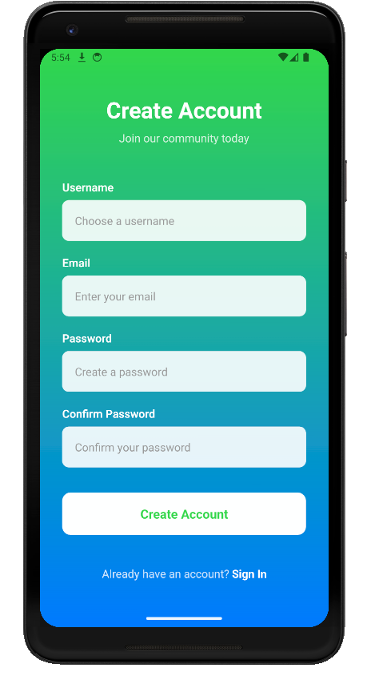

### Login
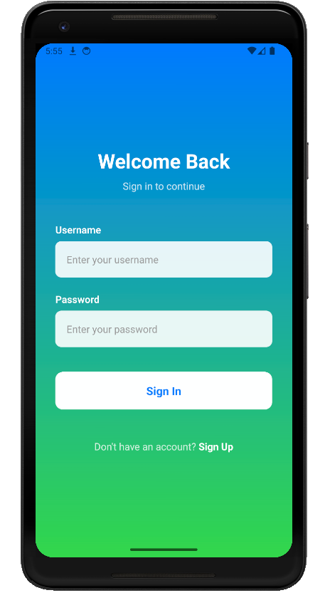

### Feed Screen
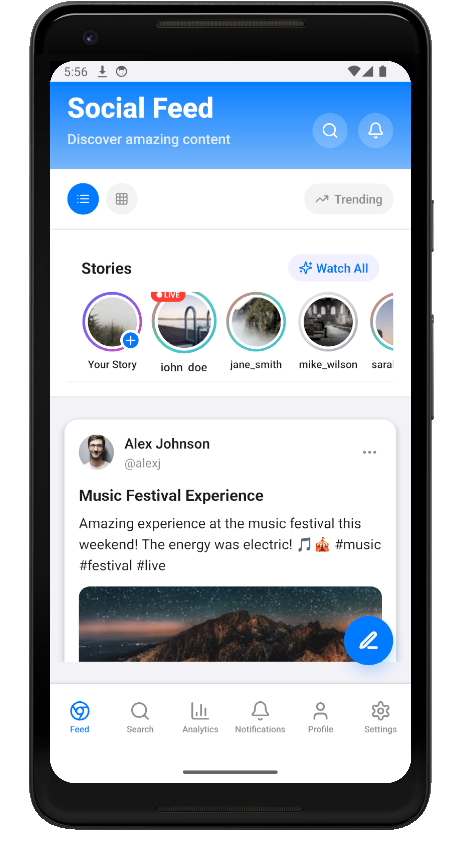 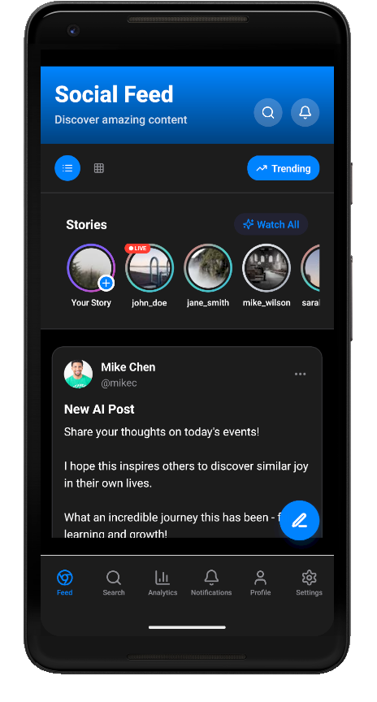

### Post Creation
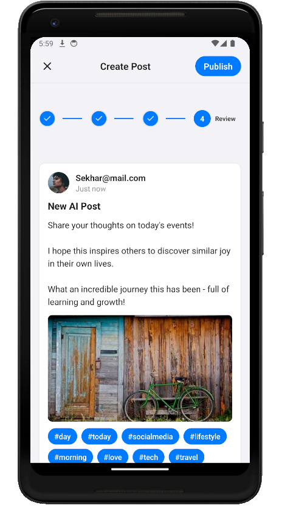

### Search
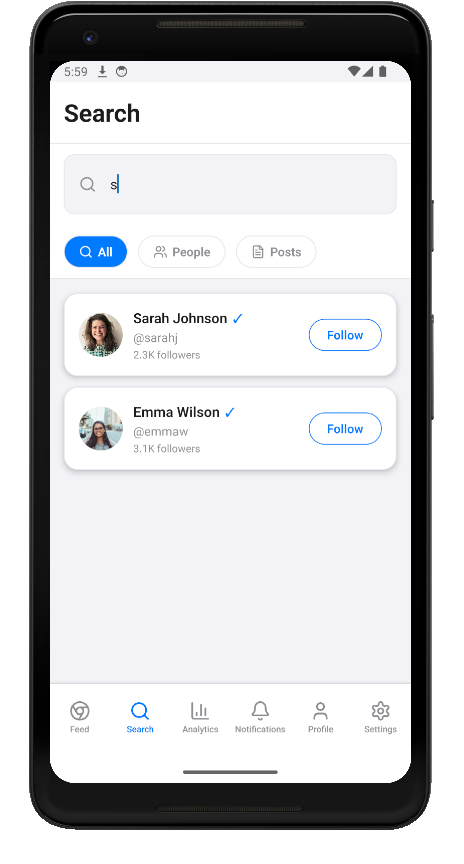

### Analytics Dashboard
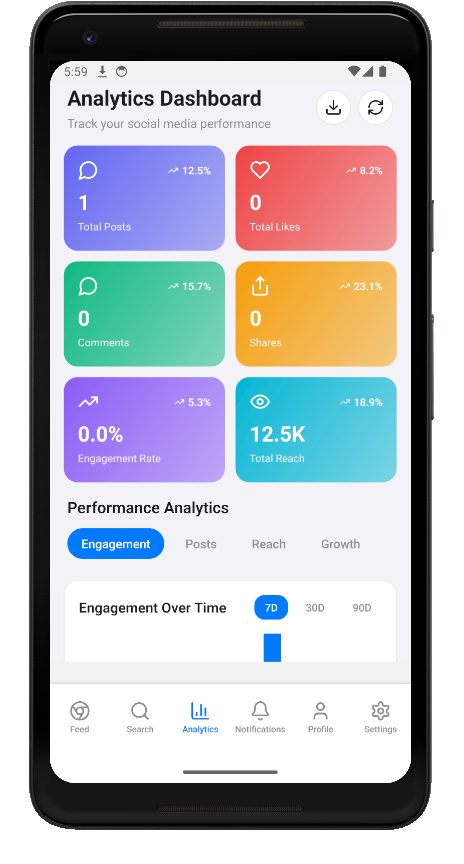

### Notifications
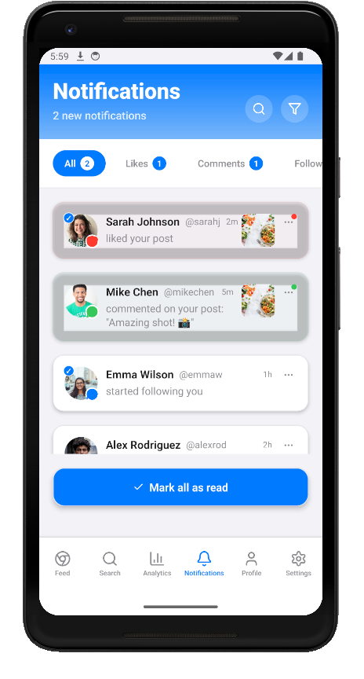

### Profile
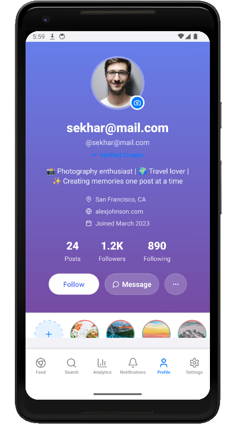 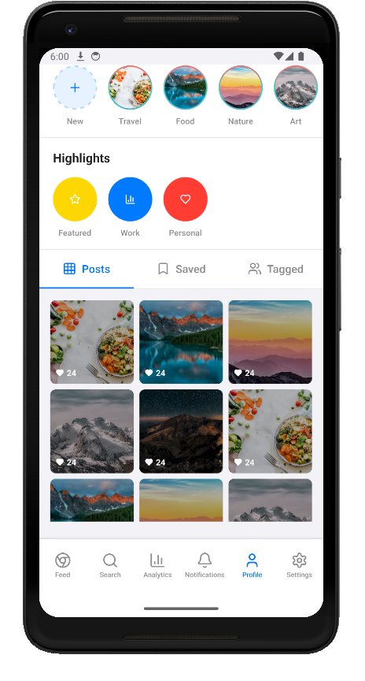

### Settings
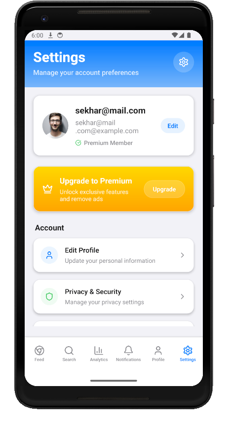

## 🤝 **Contributing**

1. Fork the repository
2. Create a feature branch
3. Make your changes with AI assistance
4. Test thoroughly on both platforms
5. Submit a pull request

## 📄 **License**

This project is licensed under the MIT License - see the [LICENSE](LICENSE) file for details.

---

**Built with ❤️ and AI assistance** - Demonstrating the future of collaborative development!